# NLOSFeatureEmbeddings Code & Datasets

This repository contains code for the paper _Learned Feature Embeddings for Non-Line-of-Sight Imaging and Recognition_ by Wenzheng Chen, Fangyin Wei, Kyros Kutulakos, Szymon Rusinkiewicz, and Felix Heide. The captured datasets can be downloaded separately from our [project webpage]().

## Results on Real Scenes
### Bike 
||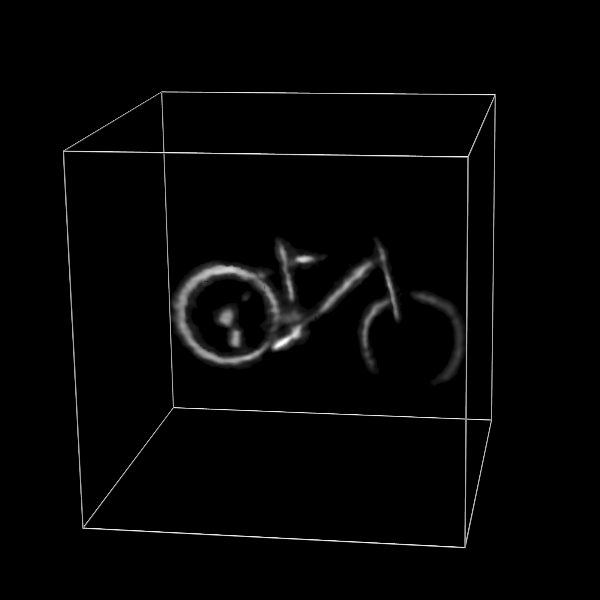|
|---|---| 

- Description: A white stone statue captured at approximately 1 m distance from the wall.
- Resolution: 512 x 512
- Scanned Area: 2 m x 2 m planar wall
- Integration times: 10 min., 30 min., 60 min., 180 min.

### Discoball 
||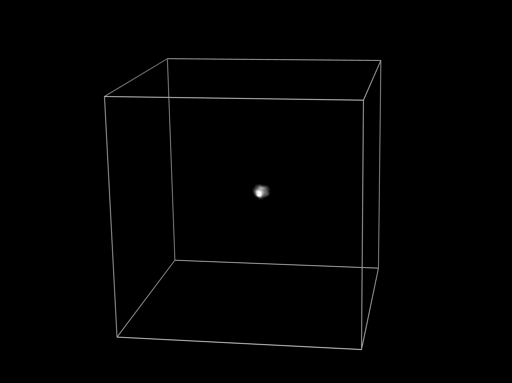|
|---|---|

- Description: A specular disoball captured at approximately 1 m distance from the wall.
- Resolution: 512 x 512
- Scanned Area: 2 m x 2 m planar wall
- Integration times: 10 min., 30 min., 60 min., 180 min.


### Dragon 
||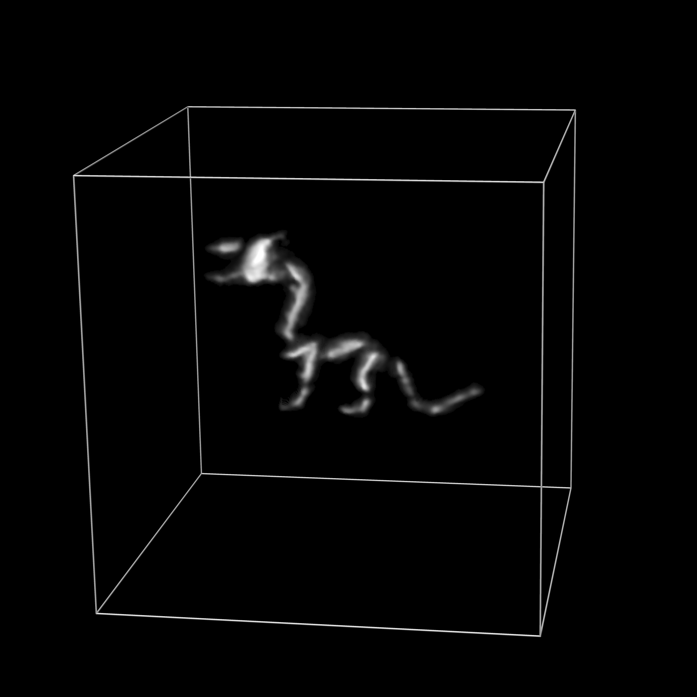|
|---|---|

- Description: A glossy dragon captured at approximately 1 m distance from the wall.
- Resolution: 512 x 512
- Scanned Area: 2 m x 2 m planar wall
- Integration times: 15 sec., 1 min., 2 min., 10 min., 30 min., 60 min., 180 min.

### Resolution 
||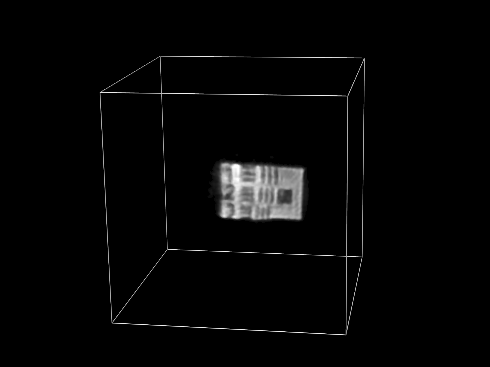|
|---|---|

- Description: A resolution chart captured at approximately 1 m distance from the wall.
- Resolution: 512 x 512
- Scanned Area: 2 m x 2 m planar wall
- Integration times: 10 min., 30 min., 60 min., 180 min.

### Statue 
||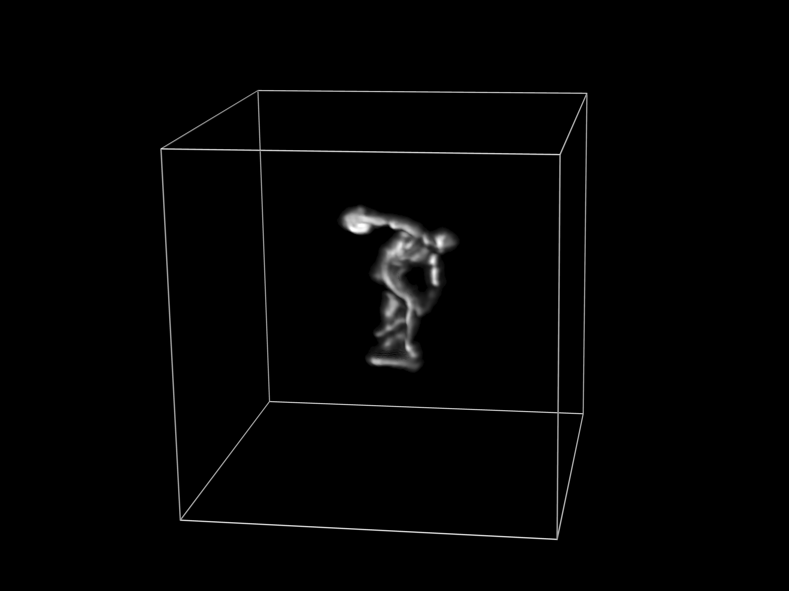|
|---|---|

- Description: A white stone statue captured at approximately 1 m distance from the wall.
- Resolution: 512 x 512
- Scanned Area: 2 m x 2 m planar wall
- Integration times: 10 min., 30 min., 60 min., 180 min.

### Teaser 
||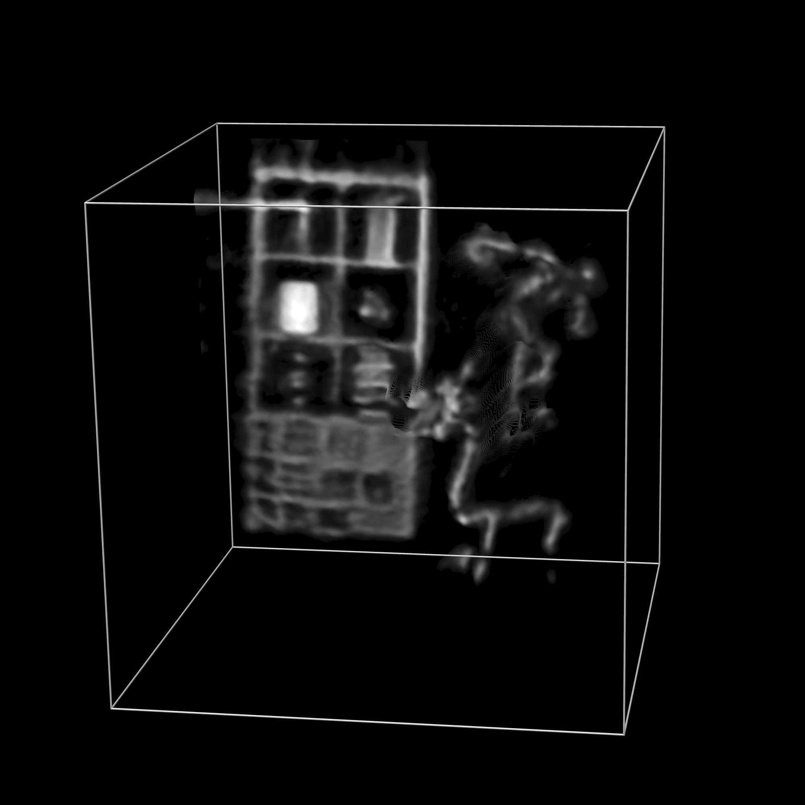|
|---|---|---|

- Description: The teaser scene used in the paper which includes a number of objects, including a bookshelf, statue, dragon, and discoball.
- Resolution: 512 x 512
- Scanned Area: 2 m x 2 m planar wall
- Integration times: 10 min., 30 min., 60 min., 180 min.


## Description of Files

The code/dataset should be organized as in the following directory tree

    ./cuda-render
        conversion/
        render/
	./data
		bunny-model/
		img/
		LICENSE
		README.md

## Usage

It contains 2 part, the first part is how to render data and the second is how to train the neural network model.
 
### Render

Please check the cuda-render folder. We recommand to open it in Nsight(tested). Other IDE should also work. To compile the code, please install cuda(tested for cuda 9.0), libglm, glew, glfw and opencv(tested for opencv 3.4).

```
sudo apt-get install libglm-dev
sudo apt-get install libglew-dev
sudo apt-get install libglfw3-dev
sudo apt-get install libopencv-dev
```

To render the 3D model, first create a cuda proejct in Nsight and put everything in cuda-render/render folder to the created project and compile. To successfully run the code, modify the folder path and data saving path in main.cpp (https://github.com/wenzhengchen/Learned-Feature-Embeddings-for-Non-Line-of-Sight-Imaging-and-Recognition/blob/1ce0287e7fb346b5dd8a8dab163111db386ad423/cuda-render/render/src/main.cpp#L32). We provide a bunny model for test.

### Render Settings

1) Change 3D model location and scale.  We change model size in two places. When we load a 3D model, we will normalize it by moving it to origin and loading with specific scale. The code can be modified in (https://github.com/wenzhengchen/Learned-Feature-Embeddings-for-Non-Line-of-Sight-Imaging-and-Recognition/blob/1ce0287e7fb346b5dd8a8dab163111db386ad423/cuda-render/render/src/display_4_loaddata.cpp#L337). Nest, when we render model, we could change the model location and rotation in (https://github.com/wenzhengchen/Learned-Feature-Embeddings-for-Non-Line-of-Sight-Imaging-and-Recognition/blob/1ce0287e7fb346b5dd8a8dab163111db386ad423/cuda-render/render/src/display_6_render.cpp#L361).

2) 3D model normal. For the bunny model, we use point normals. We emperically find it is better to use face normal for shapenet data. Please change it in (https://github.com/wenzhengchen/Learned-Feature-Embeddings-for-Non-Line-of-Sight-Imaging-and-Recognition/blob/1ce0287e7fb346b5dd8a8dab163111db386ad423/cuda-render/render/src/display_4_loaddata.cpp#L464).

3) Confocal/Non-confocal renderings. Our renderings supports both confocal and non-confocal settings. One can change it in (https://github.com/wenzhengchen/Learned-Feature-Embeddings-for-Non-Line-of-Sight-Imaging-and-Recognition/blob/1ce0287e7fb346b5dd8a8dab163111db386ad423/cuda-render/render/src/display_6_render.cpp#L613), hwere conf=0 means non-confocal while conf=1 means confocal.

4) Specular rendering. Our renderings supports both diffuse and specular materials. To render a specular object(metal material), change the switch in (https://github.com/wenzhengchen/Learned-Feature-Embeddings-for-Non-Line-of-Sight-Imaging-and-Recognition/blob/1ce0287e7fb346b5dd8a8dab163111db386ad423/cuda-render/render/src/display_6_render.cpp#L693).

5) video conversion. To convert rendered hdrfile to a video, we provide a scripts in cuda-render/conversion. Please change the render folder in (https://github.com/wenzhengchen/Learned-Feature-Embeddings-for-Non-Line-of-Sight-Imaging-and-Recognition/blob/dc12a8c907c7cd6392b7d3a0717ce650b07930fb/cuda-render/conversion/preprocess_hdr2video.py#L284) then run the python scrips. It will generate a video which is much smaller and easier to load in traning a deep leaning model.

6) SPAD simulation. The rendered hdr file does not have any noise simulation. One can add simple gaussian noise in datalaoder, but we recommand to employ a computional method for spad simulation to synthesize noise. We adopt method in (https://graphics.unizar.es/data/spad/).

7) Rendred dataset. We provide a bike dataset with 3000 bike exmaples in ().

### Render Examples

Non-confocal Renders
<table>
 <tr>
  <td> t=1.2m</td> 
  <td> t=1.4m</td> 
  <td> t=1.6m</td> 
  <td> t=1.8m</td> 
  </tr>
  <tr>
   <td> 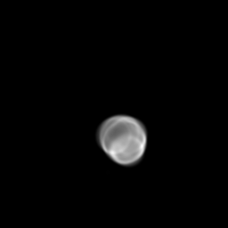</td>
<td>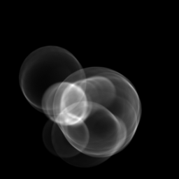</td>
<td>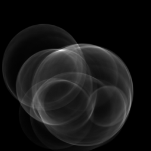</td>
<td>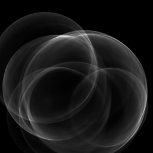</td>
   </tr> 
 </table>
 Confocal Renders
 <table>
 <tr>
  <td> t=1.2m</td> 
  <td> t=1.4m</td> 
  <td> t=1.6m</td> 
  <td> t=1.8m</td> 
  </tr>
   <tr>
    <td></td>
<td>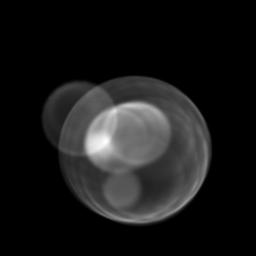</td>
<td>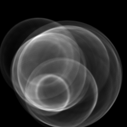</td>
<td>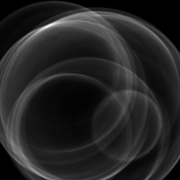</td>
  </tr>
  </table>
Specular Confocal Renders
 <table>
  <tr>
  <td> t=1.2m</td> 
  <td> t=1.4m</td> 
  <td> t=1.6m</td> 
  <td> t=1.8m</td> 
  </tr>
  <tr>
  <td>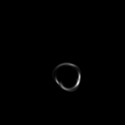</td>
<td>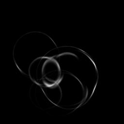</td>
<td>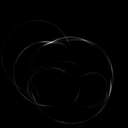</td>
<td>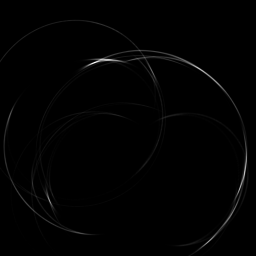</td>
  </tr>
</table>


### Deep Learning Model

In progress

**License**  
The code and dataset are licensed under the following license:

> MIT License
> 
> Copyright (c) 2020 wenzhengchen
> 
> Permission is hereby granted, free of charge, to any person obtaining a copy
of this software and associated documentation files (the "Software"), to deal
in the Software without restriction, including without limitation the rights
to use, copy, modify, merge, publish, distribute, sublicense, and/or sell
copies of the Software, and to permit persons to whom the Software is
furnished to do so, subject to the following conditions:
> 
> The above copyright notice and this permission notice shall be included in all
copies or substantial portions of the Software.
> 
> THE SOFTWARE IS PROVIDED "AS IS", WITHOUT WARRANTY OF ANY KIND, EXPRESS OR
IMPLIED, INCLUDING BUT NOT LIMITED TO THE WARRANTIES OF MERCHANTABILITY,
FITNESS FOR A PARTICULAR PURPOSE AND NONINFRINGEMENT. IN NO EVENT SHALL THE
AUTHORS OR COPYRIGHT HOLDERS BE LIABLE FOR ANY CLAIM, DAMAGES OR OTHER
LIABILITY, WHETHER IN AN ACTION OF CONTRACT, TORT OR OTHERWISE, ARISING FROM,
OUT OF OR IN CONNECTION WITH THE SOFTWARE OR THE USE OR OTHER DEALINGS IN THE
SOFTWARE.

**Contact**  
Questions can be addressed to [Wenzheng Chen](mailto:chen1474147@gmail.com)

### citation
If you find it is useful, please cite

```
@article{Chen:NLOS:2020,
title = {Learned Feature Embeddings for Non-Line-of-Sight Imaging and Recognition},
author = {Wenzheng Chen and Fangyin Wei and Kiriakos N. Kutulakos and Szymon Rusinkiewicz and Felix Heide},
year = {2020},
issue_date = {December 2020}, 
publisher = {Association for Computing Machinery}, 
volume = {39}, 
number = {6}, 
journal = {ACM Transactions on Graphics (Proc. SIGGRAPH Asia)}, 
}
```

## tl;dr
Clone the git repo, download the datasets from our project webpage, and run learning/train.py.

